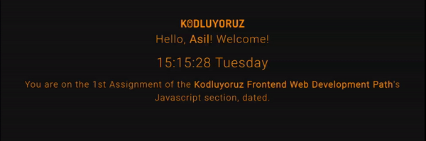

# Clock and Greeting App



This repository contains a simple JavaScript clock and greeting application. The application prompts the user for their name and then displays a greeting message with the user's name and the current time and date.

## Usage

1. Clone the repository:

```bash
git clone https://github.com/asroyx/clock-and-greeting.git
```

2. Open the `index.html` file in your web browser.

You will be prompted to enter your name. Once you have entered your name, the application will display a greeting message with your name and the current time.

## Features

- Displays a real-time clock with the hour, minute, second, and day of the week.
- Greets the user by name.
- Simple and easy to use.

## Contributing

We welcome your contributions! If you would like to contribute to this project, please follow these steps:

1. Fork the repository.
2. Create a new branch for your feature or bug fix: `git checkout -b feature-name`.
3. Make your changes: `git commit -m "Add feature"`.
4. Push your changes to your branch: `git push origin feature-name`.
5. Create a pull request from your fork to the main repository.
